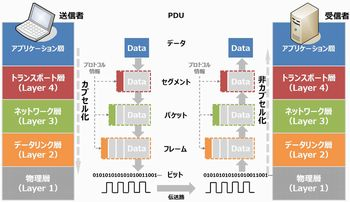
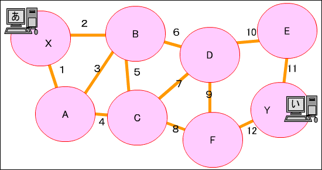
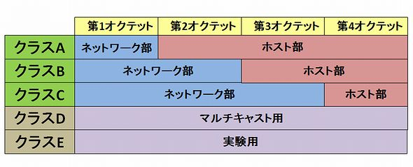
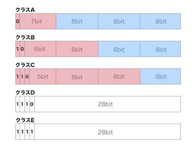
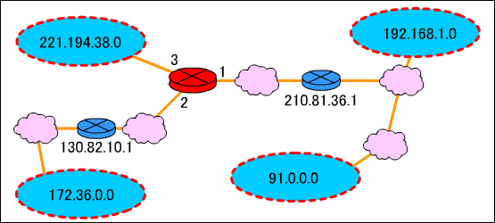

<!-- $theme: gaia -->
<!-- page_number: true -->

# ネットワーク 第1回
## Naganeo Takahito

---
# ネットワークとは何か？

- 一般的には？
	- 物流、電話網、交通、血管や神経etc...

- 共通点：「**網**」「**運ぶ**」
- ネットワークとは
	- 何かと何かが、何かによって網状に繋がって、何かを運ぶこと。

---

# コンピュータ視点で捉えると

- コンピュータとコンピュータがケーブルで網状に繋がって、データを運ぶ。
- これが「コンピュータ・ネットワーク」と呼ばれる。

---
# ネットワークの歴史
## スニーカーネットワーク

- メディアに保存したデータを人間が運ぶ
	- 文書を印刷したい！
	- →USBメモリにデータを入れプリンタまで歩く
	- バージョン管理が困難
	- リクエスト集中で混乱
	- ﾌﾟﾘﾝﾀ大量購入 → 破産
	- リソースの無駄が発生する

---
# ネットワークの進化
## LAN
- Local Area Networkの略
- 比較的狭い範囲で通信可能なネットワーク
	- 家庭、企業の1フロアetc...
- LAN内の全員がリソースを共有しあう
	- リソース＝プリンタ、データetc...

---
# LAN
- **高速**な接続を提供
	- 一般的に、1秒間に10Mビット(10Mbps)
	- 10メガビット＝1,000,000ビット
半角英数文字1つ＝1バイト＝8ビット
→10Mbps＝1秒に125,000バイト＝125,000文字
→すごい
- **高品質**な接続を提供
	- 近距離通信な分、ノイズが少ない

- LAN内のデバイスは**いつでも**LAN内の他のデバイスと接続できる。
- 
---
# ネットワークの進化
## WAN
- Wide Area Networkの略
- LANとLANを繋いでデータを送受信
- 何で繋ぐ？

---
# ネットワークの進化
## WAN
- Wide Area Networkの略
- LANとLANを繋いでデータを送受信
- 何で繋ぐ？→通信事業者にケーブルを借りる
- いつでも他のデバイスに接続できる**とは限らない**
	- 通信事業者との契約による(従量課金etc...)

---
# ネットワーク用語
## プロトコル

- 通信を行う際に使用する**ルール**のこと
- 日常の中のプロトコル
	- 日本語を話す
	- 「あれ取って」の「あれ」は○○

- TCP/IP
	- インターネットワークで利用されるプロトコル

---
# ネットワーク用語
## 帯域幅

- 本意：使用できる周波数の幅
- ケーブルの性能・規格を説明するときに使う言葉
- 転じて、**データ転送速度**
- 単位：bps

---
# ネットワーク用語
## 帯域幅

- 「道路の幅」みたいなもの

道幅が広い
→車両がたくさん通れる
→車両運搬測度が速い！

帯域幅が広い
→データがたくさん通れる
→データ転送速度が速い！

---
# ネットワーク用語
## 帯域幅

- 使用例
	- 「このデータは大きいから、帯域幅を使う」
		- 道路2車線分の大きい車両のイメージ
		- ブロードバンド(<->ナローバンド)

---
# ネットワーク・モデル

- モデル＝統一された規格
	- 使用する機器
	- ケーブルを流れる信号
	- データの表現方法 etc...
- なぜ必要？
	- 規格に合わせて作れば、相互に通信が可能
	- NECと富士通のパソコン同士が通信できない、とかは困る

---
# ネットワーク・モデル

- 各ベンダーは相互通信可能にするためにこのモデルに従う
- ただし、あくまでモデルでしかない

例えるなら...
- ベンダー　＝　画家
- ネットワークモデル　＝　被写体
- 製品　＝　絵画

ベンダー（画家）は相互通信可能なネットワークモデル（被写体）を題材に製品をつくる（絵を描く）

---
# ネットワーク・モデル

- 作成者：ISO(国際基準化機構)
- 名称　：**OSI参照モデル**(ややこしい...)
- 通信機能があるルールに基づいた階層ごとに分かれているモデル

---
# 例

- 郵便ネットワーク：誰かに手紙で意思を伝える

---
# 例

- 郵便ネットワーク：誰かに手紙で意思を伝える

手順
1. 内容を決める
2. 言葉の表現を決める（時候は？敬語？）
3. 封筒に入れ、宛名を書き、切手を貼る
7. 投函→局員が仕分け→バイクで運ぶ

---
# 例

- 郵便ネットワーク：誰かに手紙で意思を伝える

手順
1. 内容を決める（**内容**)
2. 言葉の表現を決める（時候は？敬語？）（**表現**）
3. 封筒に入れ、宛名を書き、切手を貼る（**伝送物**）
7. 投函→局員が仕分け→バイクで運ぶ（**伝送**）

---
# 例

- 郵便ネットワーク：誰かに手紙で意思を伝える

それぞれの段階でルールが必要になる。
|段階|Todo|ルール|
|:--:|:--:|:--:|
|内容|伝えたいことを考える|明瞭に・簡潔に|
|表現|手紙に書く|公用語・文語文で|
|伝送物|便箋・封筒・宛名|定型郵便・楷書で|
|伝送|局員・トラック|宛先への経路決定|

---
# OSI参照モデル・7つの層
||||
|---|:---:|:---:|
|第7層|アプリケーション層|Application Layer|
|第6層|プレゼンテーション層|Presentation Layer|
|第5層|セッション層|Session Layer|
|第4層|トランスポート層|Transport Layer|
|第3層|ネットワーク層|Network Layer|
|第2層|データリンク層|Data-Link Layer|
|第1層|物理層|Physical Layer|
名前と順番は死んでも覚える（アプセトネデブ）

---
# それぞれざっと説明
#### アプリケーション層
- ネットワークサービスそのものを提供する
	- 通信可能かどうか判断する層
#### プレゼンテーション層
- データの形式(使う言語)を決定する
#### セッション層
- データの送信、受信のまとまりを管理する層

---
# それぞれざっと説明

#### トランスポート層
- 信頼性の高い通信サービスを保障する
	- エラーを減らす、確実に届けるetc...

#### ネットワーク層
- データ伝送、ルート決定、宛先決定etc...

#### データリンク層
- ケーブルでつながれた機器とのデータ授受の制御

---
# それぞれざっと説明

#### 物理層
- 電気・機械的なルールを決めた層
	- ビット列をどう電気信号に変換するかetc...
	- 結局は電気通信の話に帰着する

---
# OSI参照モデルの意義

- 送信側：第7層から処理を行う。（カプセル化）
- 受信側：第1層から処理を行う。（非カプセル化）
- カプセル化
	- 処理情報(ヘッダ)を付加してデータを”包み込んでいく”こと
- 非カプセル化
	- 付加された処理情報(ヘッダ)を"取り外していく"こと

---
# OSI参照モデルの意義

---
# ここからはレイヤ3の話

---
# なぜなら超重要だから

---
# 準備
- NIC
ネットワーク接続に必要なパソコンの部品
具体的には、**LANケーブルを挿す穴がついているパソコンに合体する部品のこと**

- MACアドレス
NICに与えられたアドレス。
個体を識別するためだけのアドレスで、**ネットワーク内のどこにあるかは表さない**。このようなアドレスを物理アドレスという。(cf. 論理アドレス)

---
# レイヤ3

- インターネットワークにおける、ネットワーク間の接続を担当する。
- インターネットワーク
	- ネットワークのネットワーク、のこと(定義に戻れば...) 
	- 特にTCP/IPプロトコルで接続されたインターネットワークのことを**インターネット**という
- ネットワークをネットワークの集まりに細分化する、ということ
	- トラフィックの制御が可能になる

---
# レイヤ3
- レイヤ3では**論理アドレス**を用いる
- 論理アドレス：
	- **どこに**、**何があるか**を表すアドレス
- 論理アドレスを使って、データ伝送の際に経由するネットワークを探索する。
	- これを**ルーティング**という

---
# レイヤ3

---
# レイヤ3

- ネットワーク間を**ルータ**が接続する。
- ルータは論理アドレスを元にデータ伝送に最適な経路を選択する。
- ルータがなければネットワーク間の接続は行えない

---
# インターネットプロトコル
- インターネットでは**TCP/IP**プロトコルを用いて通信を行う。
- TCP/IPプロトコル：
	- 複数のプロトコルの集合体
- データ転送は**IP**が担当する

---
# インターネットプロトコル

手順
1. 受信側の論理アドレスを決定する。
2. 経路を設定する。
3. 転送する。（コネクションレス型通信）
- コネクション型通信：
	- ベストエフォート、送ったら送りっぱなし
	- 経路確保の事前やり取りなしのデータ送信

---
# インターネットプロトコル
#### IPヘッダ

- レイヤ4では、ヘッダが付加され**セグメント**が完成
- レイヤ3では、セグメントに**IPヘッダ**を付加し、**パケット**にする。
- IPヘッダには、**送信元**、**宛先の論理アドレス**が含まれる。

|20~60バイト|0~65,515バイト|
|:--:|:--:|
|IPヘッダ|セグメント|

---
# 論理アドレス

- 論理アドレスは、**ネットワーク管理者**が**各デバイス**の**ネットワークとの接続点ごとに**つける。
	- パソコンが故障して交換したとしても、接続点が同じなら同じ論理アドレスを持つ。
	- 逆に、同じパソコンでも、所属するネットワークが変われば論理アドレスも変わる。

---
# 論理アドレス

- 論理アドレスは、所属するネットワークの番号＋ホストの番号という形式
	- ネットワーク番号：接続されているすべてのネットワークでユニークでなきゃいけない。
	- ホスト番号：所属するネットワーク内でユニークでなきゃいけない。
	- 場所が変わるとアドレスも変わる(２回目)
---
# IPアドレス
- TCP/IPプロトコルで用いる論理アドレスを**IPアドレス**という。
	- プロトコルごとに論理アドレスが異なる、ということ

- IPアドレスは32ビット
	- 0または1が32個ならぶ
	- 0または1が8*4個ならぶ
	- 0~255のいずれかの数が4個ならぶ

---
# IPアドレス

IPアドレスは論理アドレスなので...

- IPアドレスは、**ネットワーク管理者**が**各デバイス**の**ネットワークとの接続点ごとに**つける。
	- パソコンが故障して交換したとしても、接続点が同じなら同じIPアドレスを持つ。
	- 逆に、同じパソコンでも、所属するネットワークが変わればIPアドレスも変わる。(3回目)

---
# クラスフルアドレッシング

- インターネット内のすべてのネットワークのネットワーク番号はユニークでなければいけない
- 統括的なネットワーク管理者が必要になる
- それが**ICANN**(あいきゃん)
- ICANNが考えたポリシーに基づいてインターネット内の各ネットワークに論理アドレスを割り振る。
- 実際に割り振りを担当するのは、国ごとに存在する**NIC**(Network Information Center)という機関
	- 日本の場合はJPNIC
---
# クラスフルアドレッシング
- ICANNは、インターネットのネットワーク番号を管理するのに、**クラス**という概念を用いる。

---
# クラスフルアドレッシング

A: 政府・国家機関・大企業
B: 中規模企業
C: 小規模企業・プロバイダ
D, E: 商用には用いられない

---
# クラスフルアドレッシング

- どのクラスのアドレスかは、先頭の数ビットで判断する

|クラス|先頭ビット列|アドレス範囲|
|:--:|:--|:--:|
|A|0|0.X.X.X ~ 127.X.X.X|
|B|10|128.X.X.X ~ 191.X.X.X|
|C|110|192.X.X.X ~ 223.X.X.X|
|D|1110|224.X.X.X ~ 239.X.X.X|
|E|11110|240.X.X.X ~ 247.X.X.X|

---
# クラスフルアドレッシング

赤：ネットワーク部、青：ホスト部
クラスがわかればそれぞれがわかる。

---
# クラスフルアドレッシング
#### 予約済アドレス

- ネットワークアドレス
	- ネットワーク自体を表すアドレス
	- ホスト部のビットがすべて0
- ブロードキャストアドレス
	- ネットワーク内の全ホストに送信するためのアドレス
	- ホスト部のビットがすべて1  

---
# クラスフルアドレッシング

#### 問題点
- 大雑把すぎて無駄が多い
- ネットワーク部が同じコンピュータは全て同一のリンクに接続する必要がある
- 例えば、クラスAの場合、1つのネットワークに対して後半24ビット分のホスト部が与えられるが、ホスト数として2^24=約1600万というのは多すぎる。
- インターネットが大きくなるにつれてネットワークアドレスが不足する。

---
# サブネッティング

- 今日、IPアドレスはクラスレスアドレス
- IPアドレス単体では、ネットワーク部、ホスト部がそれぞれ何かはわからない。
- ここで、**サブネットマスク**という32ビットの正整数値を導入することにより、ネットワーク部、ホスト部の識別を実現する。

---
# サブネッティング

ネットワーク部が先頭nビットのサブネットマスク：
- 32ビットの正整数値で、
- 先頭nビットが1で、
- それ以降が0であるもの。

例：
ネットワーク部が先頭24ビットのサブネットマスク
→　11111111 11111111 11111111 00000000
ネットワーク部が先頭24ビットのサブネットマスク
→　11111111 11111111 11111111 11000000

---
# サブネッティング

ネットワークアドレスを求めるには、IPアドレスとサブネットマスクをAND演算する。

---
# サブネットマスク

例：
IPアドレス：192.168.10.85
サブネットマスク：255.255.255.192

IPアドレス
= 11000000 10101000 00001010 01010101
サブネットマスク
= 11111111 11111111 11111111 11000000

AND演算
→ 11000000 10101000 00001010 01000000
→これがネットワークアドレス！

---
# データ伝送時に必要なアドレス

- 必須アドレス4種
	- 宛先IPアドレス
	- 宛先MACアドレス
	- 送信元IPアドレス
	- 送信元MACアドレス

---
# データ伝送時に必要なアドレス

- 送信元MACアドレス（＝自分のMACアドレス）
	- NIC取り付け時点でわかる
- 送信元IPアドレス
	- 静的or動的割り当て
    - 静的：ネットワーク管理者に割り当ててもらい、手動で入力
    - 動的：サーバーと通信して、IPアドレスを割り当ててもらう 

---
# 宛先アドレスを知るには

自分のアドレスは入手できた
では、相手方のアドレスはどのように知るか？

まずは、宛先IPアドレスから

- 相手のIPアドレスをすでに知っていれば、それを使えばよい。
- ホスト名がわかっている場合は、DNSを使用する
	- DNSサーバに対し、ホスト名に対応するIPアドレスを問い合わせる。

---
# 宛先アドレスを知るには

あとは、宛先MACアドレス

- ARP(アドレス解決プロトコル)

「このIPアドレスのホストへ あなたのMACアドレスを教えて下さい」と聞くと、そのホストがMACアドレスを教えてくれるようなプロトコル

---
# ARP

手順（宛先IPアドレスは取得済の前提）
1. ARPテーブルを参照し、宛先IPアドレスに対応するMACアドレスがあるかどうか調べる。
2. なければ、ARP要求をブロードキャスト送信。
3. ARP要求を受け取った各ホストは、ARPパケットの中の宛先IPアドレスと自分のIPアドレスを比較する。
	→一致しなければ無視、一致したらARP応答を送信
4. ARP応答を受け取ったホストはMACアドレスをARPテーブルに追加 

---
# ルータ
- ネットワークからパケットを受け取り、他のネットワークへ送り出す。
- ルータのポートが各ネットワークに所属する
- ルータを用いないデータ伝送は同じネットワーク内でしか行えないから
- ルータはルーティングテーブルを持っている

---
# デフォルトゲートウェイ

- ルータはブロードキャストドメイン（データが届く範囲）を分けることができる。
- つまり、ブロードキャストを他のネットワークに送り出さない。
- しかし、ARPはブロードキャストだったから、他ネットワークにブロードキャストできないと宛先MACアドレスが入手できないので詰む。
- 実は、いきなり他ネットワーク内のMACアドレスを知るのではなく、いったん同ネットワーク内にARPを投げて、ルータのMACアドレスを取得する、ということをする。

---
# デフォルトゲートウェイ

- ネットワーク内の全ホストは、一旦パケットをこのルータに投げる、という意味で、この役割を担うルータを**デフォルトゲートウェイ**と呼ぶ。

---
# ルーティングテーブル

|宛先|次のルータ|距離|ポート|
|:--:|:--:|:--:|:--:|
|192.168.1.0|210.81.36.1|3|1番ポート|
|91.0.0.0|210.81.36.1|6|1番ポート|
|172.36.0.0|130.82.10.1|2|2番ポート|
|221.194.38.0|なし|0|3番ポート|

---
# ルーティングテーブル

- 宛先、中継地点、距離、宛先への出口、からなる。
- ルータは、宛先IPアドレスとサブネットマスクから、宛先ネットワークアドレスを決定する（説明済）
- ルーティングテーブルに宛先がない場合、宛先不明としてパケットを破棄する。

---
# ルーティング

- ルーティングテーブルを作るためには、ルータは他ネットワークへのルートを知る必要がある。
- 知る方法は動的ルーティング、静的ルーティングがある。
- 静的ルーティングは管理者が手動で入力する。
	- 静的ルーティングは最優先される。
	- デフォルトルートも静的ルートである。

---
# ルーティング

- 動的ルーティングは自動でルート情報を交換し合う。
	- 交換し合った情報から最適なルートを選択する。
	- 障害が起きても切り離すことが可能。
	- 帯域幅や処理能力を必要とする。
	- コンバージェンスである必要がある。
	- ルーティングプロトコルで実現される。

